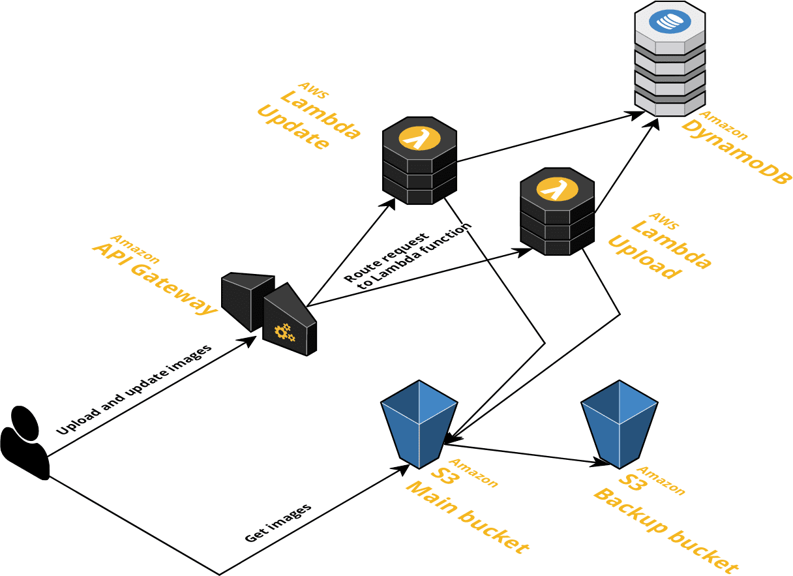

# serverless-image-app
Simple AWS Serverless app to serve images.

   

You can see a detailed explanation in [this post](https://matiaszilli.medium.com/building-a-simple-aws-serverless-app-to-upload-images-2003c2084526).   
[My Medium profile](https://matiaszilli.medium.com/).  

## Contributing

First, please read our full contributing guidelines in [CONTRIBUTING](./.github/CONTRIBUTING.md).

Report issues/questions/feature requests in the `issues` section.

## Pre-commits and doc generation

To install pre-commit and its dependecies locally in your environment, follow instructions under `docs` folder.

Code formatting and documentation for variables and outputs is generated using [pre-commit-terraform hooks](https://github.com/antonbabenko/pre-commit-terraform) which uses [terraform-docs](https://github.com/segmentio/terraform-docs).

## Authors

Created by Matias Zilli.

# Autogenerated documentation

<!-- BEGINNING OF PRE-COMMIT-TERRAFORM DOCS HOOK -->
## Requirements

| Name | Version |
|------|---------|
| terraform | >= 0.12.9 |
| aws | 2.53.0 |
| aws | >= 2.53.0 |

## Providers

No provider.

## Inputs

No input.

## Outputs

| Name | Description |
|------|-------------|
| api\_url | The URL to invoke the API pointing to the stage. e.g. https://z4675bid1j.execute-api.eu-west-2.amazonaws.com/prod |
| bucket\_domainname | The bucket domain name. Will be with format bucketname.s3.amazonaws.com. |
| http\_methods | The HTTP method (GET, POST, PUT, DELETE, HEAD, OPTIONS, ANY) |

<!-- END OF PRE-COMMIT-TERRAFORM DOCS HOOK -->
